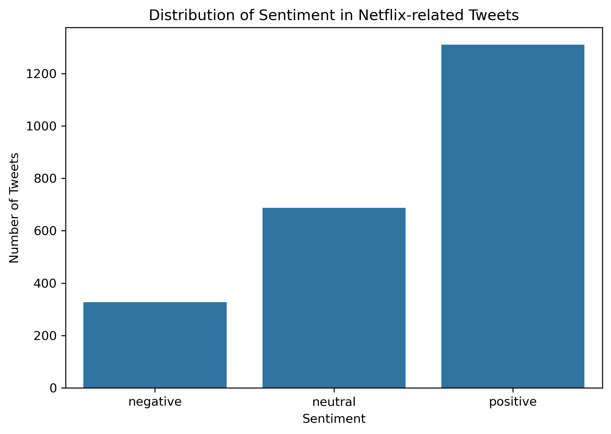
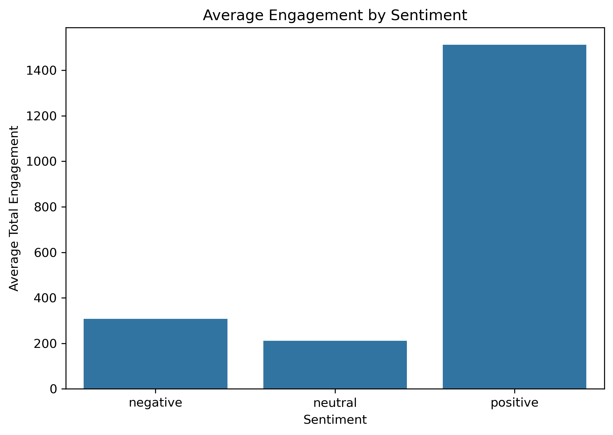
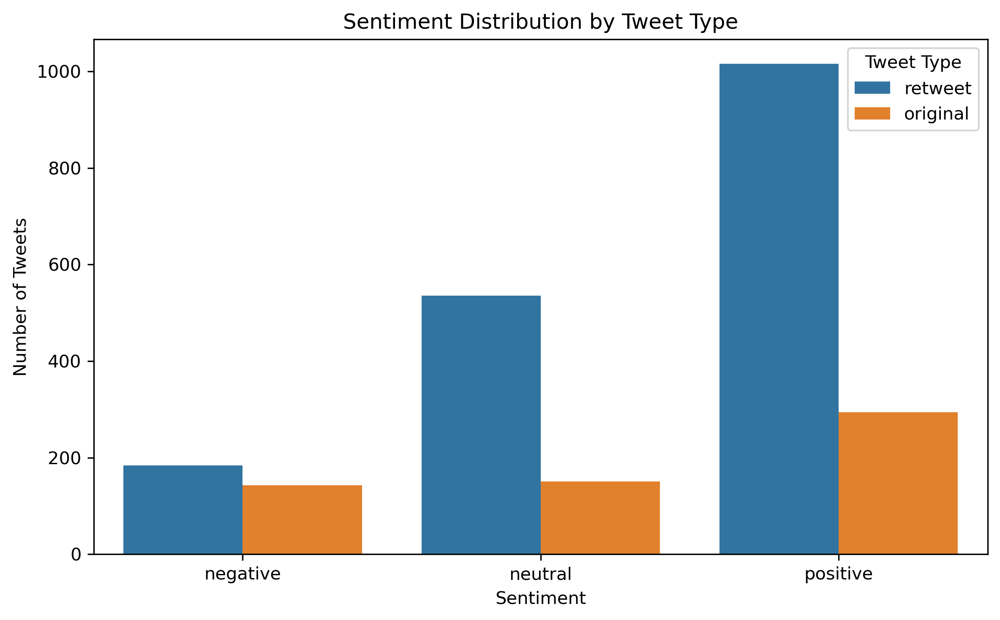

# Netflix Social Listening & Sentiment Analysis

This case study employs exploratory data analysis and natural language processing (NLP) techniques to identify how audience sentiment in Netflix-related Twitter conversations relates to user engagement and content amplification.

---

## Project Overview

This project simulates a social listening analysis for an entertainment brand by analysing Netflix-related Twitter conversations. The objective is to understand how audience sentiment can support marketing teams in campaign monitoring, audience insight generation, and content performance evaluation.

Rather than analysing tweet volume alone, this project combines sentiment classification with engagement metrics to provide deeper audience insight.

---

## Business Questions

- What is the overall sentiment distribution in Netflix-related conversations?
- Do positive, neutral, and negative tweets generate different levels of engagement?
- How do retweets differ from original tweets in sentiment patterns?
- How reliable is automated sentiment classification compared to manual coding?

---

## Dataset

The dataset consists of Netflix-related tweets stored in JSONL format and includes:

- Tweet text
- Retweet status
- Sentiment labels
- Engagement metrics (likes, retweets, impressions)

A manually validated sample of 50 tweets was used to assess sentiment classification reliability.

---

## Methodology

### 1. Data Cleaning & Preparation

- Loaded raw JSONL social media data
- Cleaned and structured relevant text and engagement fields
- Prepared sentiment-related variables

### 2. Sentiment Analysis

- Applied sentiment classification to identify positive, neutral, and negative audience reactions
- Compared sentiment groups across engagement patterns

### 3. Validation Check

- Used a manually coded sample of 50 tweets
- Compared manual sentiment labels with automated sentiment labels
- Calculated agreement rate for reliability checking

### 4. Data Visualization

Created visual summaries to support non-technical stakeholder understanding.

## Key Findings

- Audience sentiment provides useful context beyond raw engagement metrics.
- Positive sentiment often generate stronger interaction than neutral and negative content.
- Retweets Amy amplify emotionally charged content more frequently than original tweets.
- Automated sentiment analysis can support scalable social listening, but validation remains important.

---

## Business Relevance

This project demonstrates how sentiment analysis can support:

- Social listening
- Campaign monitoring
- Brand reputation tracking
- Audience insight generation
- Content strategy evaluation

---

## Tools Used

- Python
- Pandas
- Matplotlib
- Seaborn
- Jupyter Notebook

---

## Key Visual Insights

### Sentiment Distribution

### Average Engagement by Sentiment

### Sentiment by Tweet Type

---

